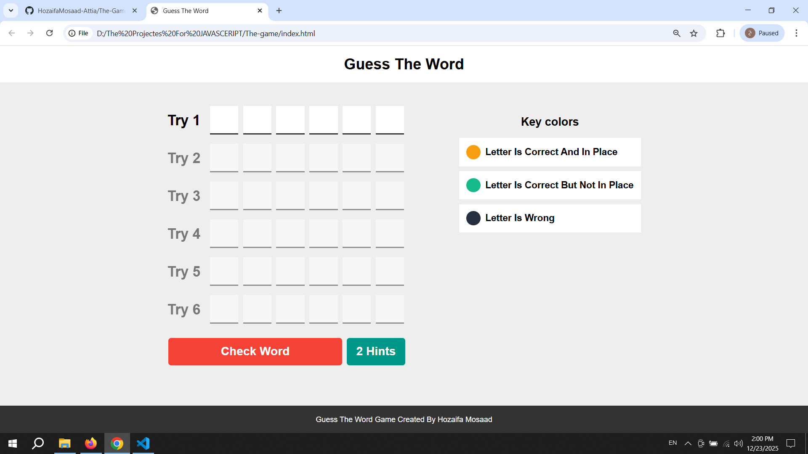

# 🎮 Wordle Game Clone
A fully functional word guessing game created with **JavaScript**. The game challenges users to guess a hidden word within limited attempts, providing visual feedback based on the accuracy of each letter.

## 🕹️ Game Rules & Features
* **Correct Letter (Green/Yellow):** The letter is in the correct spot.
* **Misplaced Letter (Gray/Orange):** The letter exists in the word but is in the wrong position.
* **Wrong Letter (Black/Dark):** The letter does not exist in the hidden word.
* **Dynamic Grid:** Automatically moves focus to the next input as you type.
* **Game Logic:** Built entirely with Vanilla JS to handle word validation and win/loss states.

## 📸 Preview

## 🛠️ Tech Stack
* **HTML5:** Game structure and input grids.
* **CSS3:** Styling for the color-coded feedback and layout.
* **JavaScript (Core):** The brain of the game, handling all logic and interactions.

---
*Inspired by Elzero Web School - Developed by [Your Name]*
